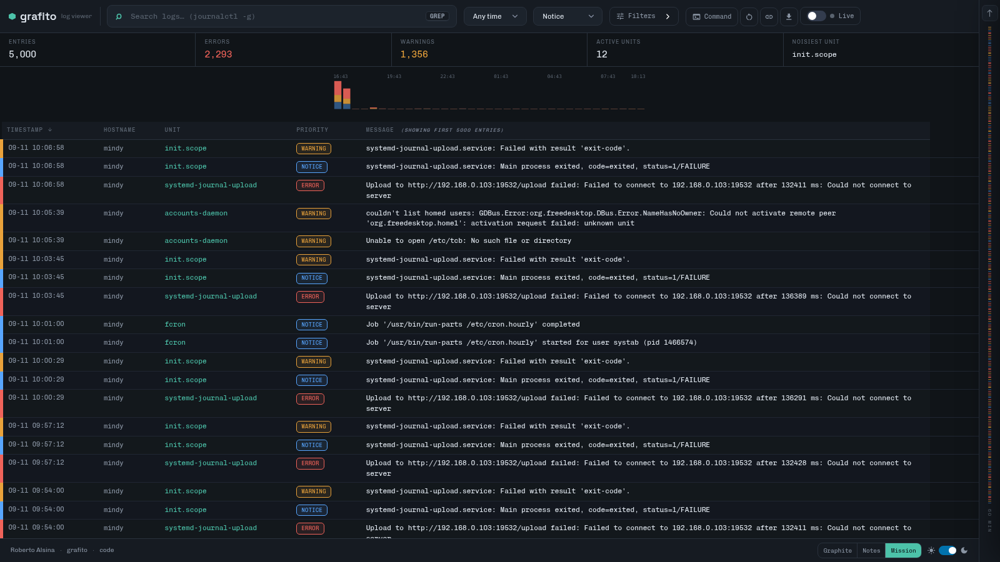
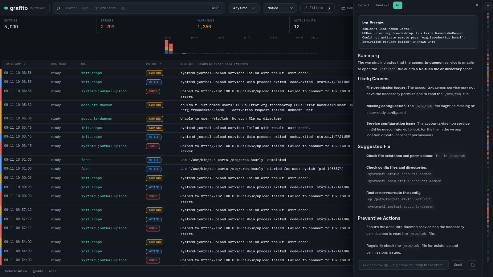
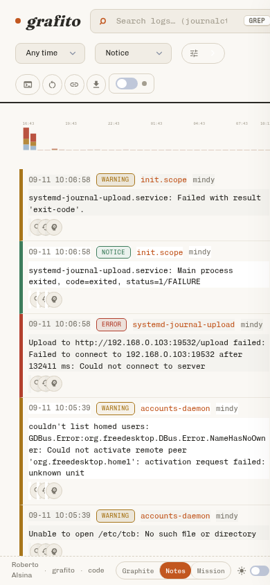

[](https://github.com/ralsina/grafito/actions/workflows/crystal.yml)
<!-- ALL-CONTRIBUTORS-BADGE:START - Do not remove or modify this section -->
[](#contributors-)
<!-- ALL-CONTRIBUTORS-BADGE:END -->

# grafito

Grafito is a simple, self-contained web-based log viewer for `journalctl`.
It provides an intuitive interface to browse and filter system logs
directly from your web browser.



<p align="center">
  
  
</p>

There is a live demo with fake logs at
[grafito-demo.ralsina.me](https://grafito-demo.ralsina.me). Demo
builds are fully interactive: every action button works against the
fake world (and the AI explanations are enabled), while nothing ever
runs on the demo host.

Key features include:

* **Mission Control UI** - a dense, dark ops-dashboard look with a
  light/dark toggle.
* **Inspector side panel** - clicking any log entry opens a Detail tab;
  Context shows the surrounding entries with the inspected one
  highlighted, and the AI tab holds the explanation.
* Live log tailing over Server-Sent Events (with an automatic fallback
  to polling) and an
  interactive severity minimap with hover previews and click-to-jump.
* An event frequency chart with adaptive buckets: click a bar to jump
  to that moment in the log.
* Filtering by unit, tag, hostname, time range, priority and a general
  search query (debounced, works on mobile).
* Mobile-friendly layout: entries collapse into two lines (metadata +
  full-width message).
* **AI-powered log explanations with iterative refinement** - ask
  follow-up questions in context (optional, requires a provider).
* **Configurable timezone support** - display timestamps in your local
  timezone or any timezone you prefer.
* **Homepage view** - a launcher for your self-hosted apps with
  optional weather widget and reachability dots, configured with a
  simple YAML file.
* An `llms.txt` (llmstxt.org format) served from every instance at
  `/llms.txt` for AI agents browsing the site.
* A dynamic user interface powered by HTMX for a smooth experience.
* Embedded assets (HTML, favicon) for easy deployment as a single
  binary.
* Built with the Crystal programming language and the Kemal web
  framework.

### AI Log Analysis

Grafito includes an optional AI feature that explains log entries in
natural language. When configured, each row shows a 🧠 button and the
inspector panel has an **AI** tab with the explanation, plus a reply
box so you can ask follow-up questions about that entry.

**Providers**

Any OpenAI-compatible endpoint works, and there are specific presets
for a few services:

| Variable | Provider |
| -------- | -------- |
| `Z_AI_API_KEY` | [z.ai](https://z.ai) GLM models |
| `ANTHROPIC_API_KEY` | Anthropic Claude |
| `OPENAI_API_KEY` | OpenAI |
| `GROQ_API_KEY` | Groq |
| `TOGETHER_API_KEY` | Together |
| `GRAFITO_AI_API_KEY` | Any OpenAI-compatible endpoint (with `GRAFITO_AI_ENDPOINT`) |

The feature is completely optional - Grafito works perfectly without
it, and the AI tab only appears when a provider is configured.

**Useful environment variables:**

```bash
export Z_AI_API_KEY="your_api_key_here"     # pick ONE provider key
export GRAFITO_AI_PROVIDER=z_ai             # optional: provider preset
export GRAFITO_AI_MODEL=glm-4.5-flash       # optional: model override
export GRAFITO_AI_ENDPOINT=http://127.0.0.1:4100/v1/chat/completions
export GRAFITO_AI_PROVIDER_NAME="ChatJimmy (Llama 3.1 8B)"  # label in the UI
export GRAFITO_AI_TIMEOUT_SEC=90            # request timeout
export GRAFITO_AI_DISABLE_THINKING=true     # for GLM reasoning models
```

The AI feature sends ±5 lines of log context around the selected entry
to analyze patterns, suggest solutions, and explain complex errors.
Prior follow-up questions are replayed too, so the answers stay in
context.

**Free ChatJimmy endpoint (hidden behind a flag):** Grafito can also
talk directly to [ChatJimmy](https://chatjimmy.ai)'s free browser
endpoint (Llama 3.1 8B, no API key needed) through its built-in
provider — an in-process port of
[jimmy-proxy](https://github.com/Fadeleke57/jimmy-proxy), so no
sidecar is needed. Because that is an unofficial use of a web
endpoint, it is never auto-detected and only runs when you ask for it
explicitly:

```bash
export GRAFITO_AI_PROVIDER=jimmy   # or "chatjimmy"
```

The upstream endpoint can change or disappear at any time; since the
provider is built in, a fix means updating Grafito (or pointing
`GRAFITO_AI_ENDPOINT` at any OpenAI-compatible service instead).

### Server Dashboard

Besides the log stream, Grafito has an optional **server dashboard**:
click the Dashboard button in the top bar (or open `/dashboard`)
to see current system health, the state of your systemd units, and a
small history chart of memory and disk usage.

* **Metrics sampling**: a background fiber samples load, memory, disk
  usage and unit states every `--sample-interval-sec` seconds (default
  30) and stores the history as daily JSONL files under
  `--data-dir` (default `/var/lib/grafito`), keeping `--retention-days`
  days (default 7). No database, no extra services.
* **JSON APIs**: `GET /status` (current snapshot + unit states) and
  `GET /status/history?since=-1d` (sampled history).
* **Unit actions** (opt-in, auth required): start Grafito with
  `--enable-actions` to get action buttons in the dashboard —
  start/stop/restart in the unit table, and contextual
  start/stop/restart plus enable/disable in the service panel (based on
  the unit's current state and `systemctl is-enabled`). Actions require
  authentication to be configured (`GRAFITO_AUTH_USER` and
  `GRAFITO_AUTH_PASS`); without credentials they are disabled with a
  warning at startup. What an action may actually do is decided by
  systemd for the user Grafito runs as: run it as yourself (with polkit
  rights or `--user` mode for your own units) and they work; run it as
  a restricted service user and failed actions say so. Each action asks
  for confirmation and is logged.
* **Gotify push alerts** (opt-in): set `GRAFITO_GOTIFY_URL` and
  `GRAFITO_GOTIFY_TOKEN` to get notified when a unit fails, when the
  journal error rate exceeds `GRAFITO_ALERT_ERRORS_PER_MIN` per minute
  (default 10), or when disk usage crosses `GRAFITO_ALERT_DISK_PCT`
  percent (default 90). Each rule fires at most once every 10 minutes.

Set `GRAFITO_DASHBOARD=false` (or `--dashboard=false`) to disable the
dashboard, its endpoints and the sampler completely.

### Docker Compose View

The third view, next to the log stream and the dashboard: click the
**Compose** button in the top bar (or open `/compose`) to see your
Docker Compose stacks, the services inside each one, and their health.

* **Stacks and services**: each stack shows its status (from
  `docker compose ls`) and a table of its containers with state,
  healthcheck verdict, image and ports (from `docker ps` and the
  compose labels, so stacks are found even without config files on
  disk).
* **Stack actions** (opt-in, auth required, same gate as unit
  actions): up (`docker compose up -d`), stop, restart, and
  **update** (pull images, then `up -d`). These run as background jobs
  and their output streams into the view live, like Dockge.
* **Service actions** (opt-in, auth required): start/stop/restart a
  single service via `docker compose`.
* **Service logs**: a pollable log tail per service, right in the
  sidebar's Detail tab, via `docker compose logs`.
* **compose.yaml view**: a read-only view of the stack's compose file.

Set `GRAFITO_COMPOSE=false` (or `--compose=false`) to disable the
compose view and its endpoints completely. Docker must be installed on
the host running Grafito for anything to show up.

#### App Store (Runtipi-compatible)

The compose view has an **Add app** button (visible when actions are
enabled): a browsable catalog of [Runtipi](https://runtipi.io)-format
app stores, so popular self-hosted tools can be installed as ordinary
compose stacks without writing a YAML file.

* **Catalog**: pick a store, search by name and filter by category.
  Cards show each app's logo, description and version; the install
  form asks for a host port plus whatever the app itself needs
  (Runtipi's `form_fields`: text, number, boolean, dropdown and
  generated-secrets fields, validated server-side).
* **Install**: Grafito renders the app's compose file and a `.env`
  (Runtipi's `APP_*` variables plus your answers; secrets are
  generated once and persisted) under its data dir, then runs
  `docker compose pull && up -d` as a streaming job. The app shows up
  as a normal stack, badged with its name and version, and is reachable
  on the host port you chose.
* **Update and uninstall**: stacks installed from a store get update
  and uninstall buttons. Update re-renders the app when the store
  ships a newer package (your answers and secrets are kept) and pulls
  the new images. Uninstall runs `down` and removes the rendered
  files; app data under `<data-dir>/app-data/` is kept.
* **Compatibility notes**: store apps are rendered for standalone
  operation — Runtipi's `x-runtipi` metadata and shared Traefik
  network are translated (host port mapping, project-local networks),
  but domain/TLS exposure through Traefik and Runtipi's shared
  PostgreSQL are not provided. Apps needing those fail at install
  time, visibly, in the job output.

Stores are configured as a comma-separated list of `name=tarball-url`
pairs (any git host's archive endpoint works):

```sh
GRAFITO_APPSTORES="official=https://codeload.github.com/runtipi/runtipi-appstore/tar.gz/refs/heads/master,mine=https://example.com/my-store.tar.gz" grafito --enable-actions
```

Set `GRAFITO_APPS=false` (or `--apps=false`) to hide the app store
while keeping the rest of the compose view. Store tarballs are cached
under `<data-dir>/appstores/` and only re-downloaded when stale or on
demand.

### Process Monitor

Click the **Processes** button in the top bar (or share a link with
`view=processes`) for "htop on a page": per-core CPU meters, summary
cards and a live process table (pid, user, state, CPU%, MEM%, VIRT,
RES, TIME+ and command) refreshed every 3 seconds. The table sorts by
any column (click the headers) and filters by user, pid or command.

* **Sorting and filtering**: every column sorts (click the headers)
  and the table filters by user, pid or command; both are applied
  server-side and persisted in the URL, so shared links reopen the view
  exactly as it was.
* **Detail panel**: clicking a row opens the sidebar's Detail tab with
  the process's user, parent, threads, start time, resource usage and
  full command line, plus a jump into its logs (the owning systemd
  unit's journal when there is one, a text search otherwise).
* **Signal actions** (opt-in, auth required): with `--enable-actions`
  and credentials configured, the table and the detail panel offer
  SIGTERM, SIGKILL, SIGSTOP and SIGCONT buttons; each asks for
  confirmation and is logged.
* **AI explanations** (opt-in): with an AI provider configured, the
  detail panel can explain what a process is doing using its /proc
  details and recent journal lines mentioning it.

Set `GRAFITO_PROCESSES=false` (or `--processes=false`) to disable the
process view and its endpoints completely.

### Homepage View

A small launcher for your self-hosted apps, in the spirit of
[gethomepage](https://gethomepage.dev) but deliberately simpler: click
the **Home** button in the top bar (or share a link with
`view=homepage`) to see a card per service group and, optionally, a
weather widget.

When the homepage view is enabled (the default), it is also what a
bare URL — no `view=` parameter — lands on; the log stream lives at
`?view=logs`. With the homepage disabled, the log stream keeps the
bare URL as before.

The page is configured with a YAML file, by default
`/etc/grafito/homepage.yml` (change it with `--homepage-config` or
`GRAFITO_HOMEPAGE_CONFIG`). Until the file exists, the view shows
setup instructions with an example, so enabling it costs nothing:

```yaml
title: Homelab

# Optional weather widget, powered by Open-Meteo (no API key).
weather:
  latitude: -34.9
  longitude: -56.16
  location: Montevideo
  units: metric # or imperial

groups:
  - name: Media
    services:
      - name: Jellyfin
        url: https://jellyfin.example.com
        description: Movies and series
        icon: play_circle # Material icon, emoji or image URL
        check: true # show an up/down dot for this service
  - name: Utilities
    services:
      - name: Home Assistant
        url: https://ha.example.com
```

* **Icons**: a Material Icons name (`play_circle`), an emoji, or an
  image URL; unset icons get a generic glyph.
* **Reachability dots**: services with `check: true` get a colored
  dot — anything answering below HTTP 500 (redirects and login pages
  included) counts as up. Checks run concurrently with a 2.5s timeout
  and are cached for a minute.
* **Weather**: current conditions plus today's high/low from
  [Open-Meteo](https://open-meteo.com), refreshed every 30 minutes and
  shown in metric or imperial units.

Set `GRAFITO_HOMEPAGE=false` (or `--homepage=false`) to disable the
homepage view and its endpoint completely.

### Adding a View

The auxiliary views (dashboard, compose, processes, homepage) are
pluggable. Adding another touches exactly five small places:

1. **Backend module**: create `src/<name>_dashboard.cr` as a module with
   a `render_html` fragment and a `register_routes` method that registers
   its endpoints (see `src/process_dashboard.cr` for the smallest
   example). Require it and call `register_routes` from
   `Grafito.register_routes` in `src/grafito.cr`, plus a
   `--<name>=BOOL` flag if it should be optional.
2. **Fragment div**: a `<div id="<name>-view" hidden hx-get="<endpoint>"
   hx-trigger="every Ns[...]">` inside `<main>` in `src/assets/index.html`.
3. **Switcher button**: a `<button data-view-mode="<name>">` in the
   `#brand-switcher`.
4. **Registry entry**: one entry in the `VIEWS` object in
   `src/assets/index.html` (element id, endpoint, poll query, URL state
   persistence/restore — see the dashboard and processes entries).
5. **Optional CSS**: nothing is needed for log-chrome hiding; only add
   rules if the view brings its own topbar widgets.

Mutual exclusion between views, the switcher highlight, URL
persistence and restore are all handled generically.

### Securing a Remote Deployment

`--enable-actions` unlocks privileged operations (systemd unit
start/stop/restart, process signals), and basic auth sends credentials
on every request. Over plain HTTP, anyone on the network can read
both.

For anything beyond `localhost`, put grafito behind a TLS-terminating
reverse proxy and keep it bound to `127.0.0.1` (the default). Any
proxy works with the default setup; two common examples:

**Caddy** (automatic certificates):

```
grafito.example.com {
    reverse_proxy 127.0.0.1:3000
}
```

**Nginx** (certificates via certbot):

```
server {
    listen 443 ssl;
    server_name grafito.example.com;

    location / {
        proxy_pass http://127.0.0.1:3000;
        proxy_set_header Host $host;
    }
}
```

Then set `GRAFITO_AUTH_USER` / `GRAFITO_AUTH_PASS` and add
`--enable-actions`: the proxy encrypts both the basic-auth credentials
and the privileged commands they authorize. Grafito logs a warning at
startup if actions are enabled on a non-loopback bind address.

As a second layer of defense, all state-changing POST endpoints reject
cross-site requests: browsers' `Sec-Fetch-Site` header is honored, and
`Origin`/`Referer` are checked against the host when present, so a
malicious page cannot ride your session to trigger actions. Known
trade-off: a request carrying none of those headers (very old
browsers, or a `no-referrer` policy) is allowed through because
non-browser clients like curl send none either — another reason to
keep authentication on for anything beyond loopback.

If you don't need actions remotely, bind to `127.0.0.1` and skip
`--enable-actions` entirely — everything else (logs, dashboard,
compose, processes) works read-only.

### Timezone Configuration

Grafito displays timestamps in your local timezone by default, but you can configure it to use any timezone you prefer. This solves the issue of having to mentally convert UTC timestamps to your local time.

**To configure timezone:**

1. **Command line option**:
   ```bash
   ./bin/grafito --timezone America/New_York
   ./bin/grafito --timezone Europe/London
   ./bin/grafito --timezone GMT+5
   ./bin/grafito --timezone local  # Default behavior
   ```

2. **Environment variable**:
   ```bash
   export GRAFITO_TIMEZONE="America/New_York"
   ./bin/grafito
   ```

3. **In systemd service**:
   ```ini
   Environment="GRAFITO_TIMEZONE=America/New_York"
   ```

**Supported timezone formats:**
- **IANA timezone names**: `America/New_York`, `Europe/London`, `Asia/Tokyo`, etc.
- **GMT offsets**: `GMT+5`, `GMT-3`, `GMT+5:30` (supports hours and minutes)
- **Special values**: `local` (system timezone), `utc` (UTC timezone)

By default, Grafito uses your system's local timezone, so most users won't need to configure anything unless they want to use a different timezone.

### User Systemd Mode Configuration

Grafito supports user systemd instances for users without root privileges. When enabled, Grafito uses `journalctl --user` and `systemctl --user` to access user-level services and logs.

**To enable user mode:**

1. **Command line option**:
   ```bash
   ./bin/grafito --user
   ```

2. **Environment variable**:
   ```bash
   export GRAFITO_USER_MODE=true
   ./bin/grafito
   ```

3. **In systemd user service**:
   ```ini
   [Service]
   Environment="GRAFITO_USER_MODE=true"
   ExecStart=/usr/local/bin/grafito -b 127.0.0.1 -p 3000
   ```

**Notes:**
- User mode only shows logs and services for the current user
- System-level logs and services are not accessible in user mode
- Default is system mode (requires appropriate permissions)

## Installation

If you are using Arch Linux grafito is [available in AUR](https://aur.archlinux.org/packages/grafito)

### Using the Install Script (Linux with systemd)

For a quick installation on Linux systems with systemd, you can use the provided installation script. This script will:

1. Download the correct Grafito binary for your system's architecture (amd64 or arm64) for the latest version tagged in the script.
2. Install it to `/usr/local/bin/grafito`.
3. Set up and enable a systemd service for Grafito.

To use the script, run the following command:

```bash
curl -sSL https://grafito.ralsina.me/install.sh | sudo bash
```

After installation, Grafito should be running and accessible at `http://<your_server_ip>:1111` (or the port configured in the service). You can check its status with `systemctl status grafito.service`.

### Prebuilt Binaries

To install from prebuilt binaries, download the latest release from the
[releases page](https://github.com/ralsina/grafito/releases). The binaries are
available for linux, both x86_64 and arm64 architectures. You can get an example
`grafito.service` [from the repository.](https://github.com/ralsina/grafito/blob/main/grafito.service)


### Install from source:

1. **Clone the repository:**


    ```bash
    git clone https://github.com/ralsina/grafito.git
    cd grafito
    ```

2. **Install Crystal dependencies:**

    ```bash
    shards install
    ```

3. **Build the application:**

    ```bash
    shards build --release
    ```

    This will create a single executable file named `bin/grafito`

### Run using Docker

It doesn't make much sense to run Grafito in a container, but if you want to:

```bash
docker run -p 3000:3000 -v/var/log/journal:/var/log/journal ghcr.io/ralsina/grafito:latest
```

Or if you are using ARM:

```bash
docker run -p 3000:3000 -v/var/log/journal:/var/log/journal ghcr.io/ralsina/grafito-arm64:latest
```

## Usage

Simply run the compiled binary:

```bash
./bin/grafito
```

Then open your web browser and navigate to `http://localhost:3000`
(or the port specified if configured differently).

The application requires `journalctl` and `systemctl` to be
available on the system where it's run.

## Running with systemd

To run Grafito as a systemd service, you can create a service file.

1. **Create the service file:**

    Create a file named `grafito.service` in `/etc/systemd/system/` (or `~/.config/systemd/user/` for a user service) with the following content. Adjust paths and user/group as necessary.

    ```ini
    [Unit]
    Description=Grafito Log Viewer
    After=network.target

    [Service]
    Type=simple
    DynamicUser=yes
    # If set to "systemd-journal" it can access all logs in the system
    # Change if that is not what you want.
    Group=systemd-journal

    # --- Authentication Configuration ---
    # Set these environment variables to enable Basic Authentication.
    # If GRAFITO_AUTH_USER and GRAFITO_AUTH_PASS are not set, Grafito will run without authentication.
    Environment="GRAFITO_AUTH_USER=your_grafito_username"
    Environment="GRAFITO_AUTH_PASS=your_strong_grafito_password"

    # Replace with the actual path to your Grafito directory
    WorkingDirectory=/usr/local/bin/
    # Replace with the actual path and options to the Grafito binary
    ExecStart=/usr/local/bin/grafito -b 0.0.0.0 -p 1111
    Restart=on-failure

    [Install]
    WantedBy=multi-user.target
    ```

2. **Reload systemd daemon:**

   ```bash
   sudo systemctl daemon-reload
    ```

3. **Enable the service (to start on boot):**

   ```bash
   sudo systemctl enable grafito.service
   ```

4. **Start the service:**

   ```bash
   sudo systemctl start grafito.service
   ```

5. **Check the status:**

   ```bash
   sudo systemctl status grafito.service
   ```

## Running with systemd socket activation

To conserve resources and enable tighter sandboxing, it's also possible to run
grafito as a [socket-activated](https://0pointer.de/blog/projects/socket-activation.html)
systemd service. This makes grafito start up on demand. You can also use the
`--idle-timeout-sec` flag to make grafito shut down after a set period without
any new requests.

1. **Create the service file:**

    Create a file named `grafito.service` in `/etc/systemd/system/` (or `~/.config/systemd/user/` for a user service) with the following content. Adjust paths and user/group as necessary.

    ```ini
    [Unit]
    Description=Grafito Log Viewer
    After=network.target

    [Service]
    Type=simple
    DynamicUser=yes
    # If set to "systemd-journal" it can access all logs in the system
    # Change if that is not what you want.
    Group=systemd-journal

    # --- Authentication Configuration ---
    # Set these environment variables to enable Basic Authentication.
    # If GRAFITO_AUTH_USER and GRAFITO_AUTH_PASS are not set, Grafito will run without authentication.
    Environment="GRAFITO_AUTH_USER=your_grafito_username"
    Environment="GRAFITO_AUTH_PASS=your_strong_grafito_password"

    # Replace with the actual path to your Grafito directory
    WorkingDirectory=/usr/local/bin/
    # Shut down after 5 minutes without requests
    ExecStart=/usr/local/bin/grafito --idle-timeout-sec=300
    ```

2. **Create the socket file:**

    Create a [systemd socket file](https://www.freedesktop.org/software/systemd/man/latest/systemd.socket.html) named `grafito.socket` in `/etc/systemd/system/` (or `~/.config/systemd/user/` for a user service) with the following content. This file should have the same basename as the service file created above - in this case, `grafito`.

    ```ini
    [Unit]
    Description=Socket for grafito log UI

    [Socket]
    # Set the port and, if desired, address to listen on here
    ListenStream=1111
    NoDelay=true

    [Install]
    WantedBy=sockets.target
    ```

3. **Reload systemd daemon:**

   ```bash
   sudo systemctl daemon-reload
    ```

4. **Enable and start the socket:**

   ```bash
   sudo systemctl enable --now grafito.socket
   ```

5. **Make a request to wake the server:**
   ```bash
   curl http://localhost:1111
   ```

6. **Check the status:**
   ```bash
   sudo systemctl status grafito.service grafito.socket
   ```

## Journald Permissions

By default, `journalctl` (and therefore Grafito) can only access the logs of the user running the command. To allow Grafito to access all system logs, the user running the Grafito process needs to be part of a group that has permissions to read system-wide journal logs.

Typically, this is the `systemd-journal` group (the name might vary slightly depending on your Linux distribution).

1. **Add the user to the `systemd-journal` group:**
   Replace `your_user` with the actual username that will run the Grafito process.

   ```bash
   sudo usermod -a -G systemd-journal your_user
   ```

2. **Apply group changes:**
   The user will need to log out and log back in for the new group membership to take effect.
   If Grafito is already running as a service under this user, you might need to restart the
   service:

   ```bash
   sudo systemctl restart grafito.service
   ```

Alternatively, if you are running Grafito directly (not as a service) and want to grant
it temporary access for a session, you might run it with `sudo`, but this is generally
not recommended for web applications for security reasons. Configuring the user with
appropriate group membership is the preferred method.

**Security Note:** Granting access to all system logs means that any user who can access
Grafito will be able to see these logs. Ensure that Grafito itself is appropriately secured
if it's exposed to untrusted networks.

## Logs from multiple hosts

Systemd Journald offers mechanisms to centralize logs from multiple hosts onto a single machine. This is particularly useful for managing logs in a distributed environment. Two common tools for this are `systemd-journal-remote` and `systemd-journal-upload`.

* **`systemd-journal-upload`**: This service runs on client machines and uploads their local journal entries to a remote `systemd-journal-remote` instance. It can be configured to send logs securely over HTTPS.
* **`systemd-journal-remote`**: This service runs on a central log server and listens for incoming journal data (typically via HTTP/HTTPS) from `systemd-journal-upload` instances. It then stores these logs in the local journal on the central server.

When logs from multiple hosts are consolidated onto the server where Grafito is running, each log entry will typically retain its original `_HOSTNAME` field. This is where Grafito's **Hostname filter** becomes very useful.

By using the "Hostname" filter in the Grafito UI, you can easily isolate and view logs originating from a specific client machine, even though all logs are stored and queried on the central Grafito server. For example, if you have logs from `server1`, `server2`, and `web-node-alpha` all being sent to your Grafito host, you can simply type `server1` into the Hostname filter to see only its logs.

### Configuration Sketch

1. **On the Central Log Server (where Grafito runs):**
   * Install and configure `systemd-journal-remote` to listen for incoming logs. You'll typically configure it to use HTTPS for security.
   * Ensure the journal on this server has enough storage space.

2. **On Each Client Host:**
   * Install and configure `systemd-journal-upload`.
   * Point it to the address and port of your central `systemd-journal-remote` instance.
   * Configure necessary authentication (e.g., client certificates) if HTTPS is used.

Once set up, logs from all client hosts will appear in Grafito on the central server, and you can use the Hostname filter to distinguish between them. Refer to the official systemd documentation for detailed instructions on configuring `systemd-journal-remote` and `systemd-journal-upload`.

## Development

1. **Prerequisites:**
   * Ensure you have Crystal installed.
   * Ensure `journalctl` and `systemctl` are available on your development machine.

2. **Clone and Setup:**
   Follow the "Install from source" instructions above to clone the repository and
   install dependencies using `shards install`.

3. **Run for Development:**
   To run the application locally with automatic recompilation on changes, you can
   use a tool like Sentry.cr or simply recompile and run manually:

   ```bash
   shards run grafito
   ```

   The application will typically be available at `http://localhost:3000`.

4. **Linting:**
   This project uses Ameba for static code analysis. CI builds it from
   the vendored source, so the equivalent local command is:

   ```bash
   crystal build lib/ameba/bin/ameba.cr -o bin/ameba && bin/ameba src spec
   ```

5. **Demo site:**
   The public demo at [grafito-demo.ralsina.me](https://grafito-demo.ralsina.me)
   runs fake journal data with AI enabled. It is deployed as a docker
   compose stack (see `demo-site/compose.yml`) running the demo image;
   AI explanations come from Grafito's built-in ChatJimmy provider, so
   the stack needs no sidecar. `./deploy_site.sh` builds, pushes and
   deploys it.

   Demo builds (compiled with `-Ddemo_mode`) are fully interactive:
   every action button is shown and works against the fake world —
   stopping a unit shows it as dead, installing an app store app
   creates its stack, killing a process removes it from the table —
   and simulated state lives until the demo container restarts. Job
   output is labeled "Demo mode: this output is simulated", and
   actions that cannot be simulated answer with a demo notice. No
   docker, systemctl or journalctl command ever runs on the demo host.

6. **Real instance:**
   The real Grafito instance (actual system journal, also with AI via
   the built-in ChatJimmy provider) runs as the docker compose stack in
   `/data/stacks/grafito` on the server, using the published
   `ghcr.io/ralsina/grafito-arm64` image. `real-site/compose.yml` is
   the source of truth for that stack: it bind-mounts
   `/var/log/journal`, `/etc/machine-id` and `/etc/localtime` read-only
   so the container sees the host journal in the host timezone.

## Contributing

1. Fork it (<https://github.com/ralsina/grafito/fork>)
2. Create your feature branch (`git checkout -b my-new-feature`)
3. Commit your changes (`git commit -am 'Add some feature'`)
4. Push to the branch (`git push origin my-new-feature`)
5. Create a new Pull Request

## Contributors

* [Roberto Alsina](https://github.com/ralsina) - creator and maintainer
<!-- ALL-CONTRIBUTORS-LIST:START - Do not remove or modify this section -->
<!-- prettier-ignore-start -->
<!-- markdownlint-disable -->
<table>
  <tbody>
    <tr>
      <td align="center" valign="top" width="14.28%"><a href="http://omaralani.dev"><br /><sub><b>Omar Alani</b></sub></a><br /><a href="https://github.com/ralsina/grafito/commits?author=omarluq" title="Code">💻</a></td>
    </tr>
  </tbody>
</table>

<!-- markdownlint-restore -->
<!-- prettier-ignore-end -->

<!-- ALL-CONTRIBUTORS-LIST:END -->
